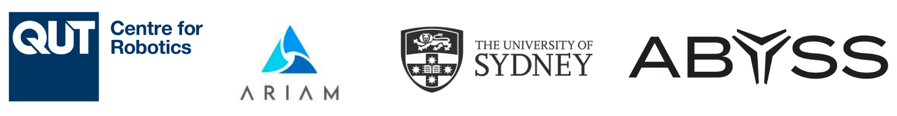

# Multi-View Pose-Agnostic Change Localization with Zero Labels - CVPR 2025
*Chamuditha Jayanga, Jason Lai, Lloyd Windrim, Donald Dansereau, Niko Suenderhauf, Dimity Miller*

[](https://chumsy0725.github.io/MV-3DCD/) [](https://arxiv.org/abs/2412.03911) [](https://huggingface.co/datasets/ChamudithaJay/PASLCD/tree/main)




*Abstract*: Autonomous agents often require accurate methods for detecting and localizing changes in their environment, particularly when observations are captured from unconstrained and inconsistent viewpoints. We propose a novel label-free, pose-agnostic change detection method that integrates information from multiple viewpoints to construct a change-aware 3D Gaussian Splatting (3DGS) representation of the scene. With as few as 5 images of the post-change scene, our approach can learn an additional change channel in a 3DGS and produce change masks that outperform single-view techniques. Our change-aware 3D scene representation additionally enables the generation of accurate change masks for unseen viewpoints. Experimental results demonstrate state-of-the-art performance in complex multi-object scenes, achieving a 1.7x and 1.5x improvement in Mean Intersection Over Union and F1 score, respectively, over other baselines. 
We also contribute a new real-world dataset to benchmark change detection in diverse challenging scenes in the presence of lighting variations.

## BibTeX
```shell
@inproceedings{galappaththige2025mv3dcd,
      title={Multi-View Pose-Agnostic Change Localization with Zero Labels}, 
      author={Chamuditha Jayanga Galappaththige and Jason Lai and Lloyd Windrim and Donald Dansereau and Niko Suenderhauf and Dimity Miller},
      booktitle={Proceedings of the IEEE/CVF Conference on Computer Vision and Pattern Recognition},
      year={2025},
}
```

## Dataset

We have released our ***Pose-Agnostic Scene Level Change Detection (PASLCD) Dataset*** on [Hugging Face](https://huggingface.co/datasets/ChamudithaJay/PASLCD/tree/main). You can either manually download the dataset by visiting [Hugging Face](https://huggingface.co/datasets/ChamudithaJay/PASLCD/tree/main) or download the dataset using `huggingface-cli`.
```shell
pip install -U "huggingface_hub[cli]"
huggingface-cli download ChamudithaJay/PASLCD PASLCD.zip --local-dir data/ --repo-type dataset
unzip ./data/PASLCD.zip -d ./data/
```

## Environment Setup

We use `Conda` for environment and package management. 
```shell
conda create -n mv3dcd python=3.8
conda activate mv3dcd
```
PyTorch (Please use a compatible CUDA version - code was tested with 12.4)
```shell
pip install torch==2.4.0 torchvision==0.19.0 torchaudio==2.4.0 --index-url https://download.pytorch.org/whl/cu124
```
Install `gsplat`
```shell
pip install git+https://github.com/nerfstudio-project/gsplat.git@v1.4.0
```
Install other required libraries
```shell
pip install plyfile opencv-python timm matplotlib scikit-learn torchmetrics
```
Build and install `simple-knn`
```shell
pip install submodules/simple-knn
```

## Running Experiments

To run the experiments for all 10 scene you can use the `run.sh` script
```shell
bash run.sh
```
I have tested and reprduced the results with `PyTorch==2.4.0, gsplat==1.4.0, CUDA==12.4` on `RTX4080` and `A100`. You can expect the resluts to be slightly better than the reported.  

Although our implementation is based on the vanilla 3DGS, our method can be easily integrated into most approaches that have made numerous advancements to the original 3DGS. If you make any such integrations, feel free to open a pull request.

### Acknowledgement

Our code is based on [3D Gaussian Splatting](https://github.com/graphdeco-inria/gaussian-splatting), [Feature-3DGS](https://github.com/ShijieZhou-UCLA/feature-3dgs) and [Dino-vit-features](https://github.com/ShirAmir/dino-vit-features). We sincerely thank the authors for opensourcing their codebase. 

### Funding Acknowledgement

This work was supported by the ARC Research Hub in Intelligent Robotic Systems for Real-Time Asset Management (ARIAM) (IH210100030) and Abyss Solutions. C.J., N.S., and D.M. also acknowledge ongoing support from the QUT Centre for Robotics.


